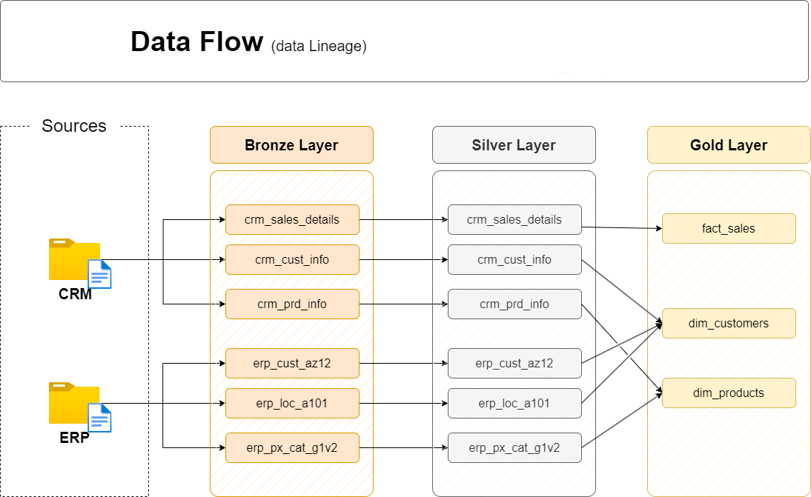
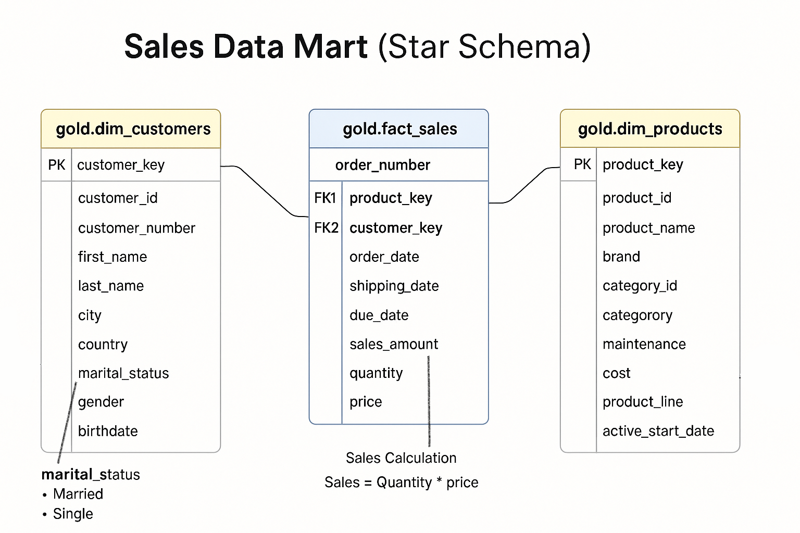
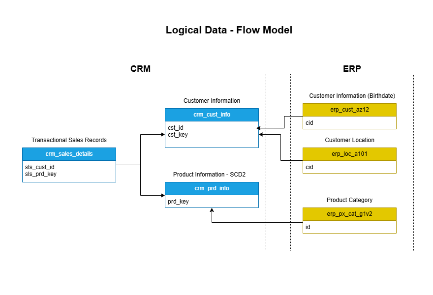

# Retail Analytics Data Warehouse

A data warehouse solution for retail analytics, implementing a modern data architecture with bronze, silver, and gold layers for efficient data processing and analysis.

## Project Overview

This data warehouse project is designed to handle retail data analytics, focusing on customer information, product details, and sales transactions. The solution implements a Medallion architecture (bronze, silver, gold) to ensure data quality, transformation, and accessibility for business intelligence purposes.

## Architecture

The project follows Medallion architecture pattern with three distinct layers:

1. **Bronze Layer**: Raw data ingestion and initial storage
2. **Silver Layer**: Cleaned and transformed data
3. **Gold Layer**: Business-ready analytics views

### Data Flow

The data flow diagram (images/data_flow.png) illustrates how data moves through the system:
- Source data is first loaded into bronze layer tables
- Data is then transformed and cleaned in the silver layer
- Finally, business-ready views are created in the gold layer

### Database Schema

The project uses a star schema design (images/star_schema.png) optimized for retail analytics, with:
- Fact tables for sales transactions
- Dimension tables for customers, products, and locations
- Supporting tables for additional business context

## Implementation Details

### Database Setup

The project uses SQL Server and is initialized through `scripts/01_init_database.sql`, which:
- Creates the main database (DataWarehouseRetail)
- Establishes three schemas (bronze, silver, gold)
- Sets up the foundation for data processing

### Key Scripts

1. **Initialization (01_init_database.sql)**
   - Sets up the database structure
   - Creates necessary schemas
   - Establishes the foundation for data processing

2. **Customer Information (02_ddl_cust_info.sql)**
   - Defines customer dimension tables
   - Implements data quality constraints
   - Sets up customer data structure

3. **Bulk Loading (03_bulk_load.sql)**
   - Handles initial data loading
   - Implements data validation
   - Manages data import processes

4. **Main Process Build (04_main_proc_build.sql)**
   - Implements the core data processing logic
   - Handles data merging and updates
   - Manages data quality checks
   - Tracks data processing metrics

5. **Silver Layer Processing (05_ddl_cust_info_silver.sql, 06_silver_load_proc.sql)**
   - Implements data transformation logic
   - Handles data cleaning and standardization
   - Prepares data for analytics

6. **Gold Layer Views (07_gold_views_query.sql)**
   - Creates business-ready views
   - Implements analytics-ready data structures
   - Optimizes for query performance

## Key Script Explanations

### Silver Layer Processing (06_silver_load_proc.sql)

This script contains several complex data transformations. Here are some notable examples:


1. **Product Data Processing**
```sql
CASE 
    WHEN UPPER(TRIM(prd_line)) = 'M' THEN 'Mountain'
    WHEN UPPER(TRIM(prd_line)) = 'R' THEN 'Road'
    WHEN UPPER(TRIM(prd_line)) = 'S' THEN 'Other Sales'
    WHEN UPPER(TRIM(prd_line)) = 'T' THEN 'Touring'
    ELSE 'n/a'
END AS prd_line
```
Maps product line codes to descriptive categories, improving readability for business users.

2. **Product End Date Calculation**
```sql
CAST(
    LEAD(prd_start_dt) OVER (PARTITION BY prd_key ORDER BY prd_start_dt) - 1 
    AS DATE
) AS prd_end_dt
```
This calculation ensures logical product date ranges by:
- Using the LEAD window function to look at the next start date for each product
- Setting the end date as one day before the next start date
- Preventing invalid date ranges where end dates could be after start dates
- Maintaining data integrity for product lifecycle tracking

3. **Sales Data Validation**
```sql
CASE 
    WHEN sls_sales IS NULL OR sls_sales <= 0 OR sls_sales != sls_quantity * ABS(sls_price) 
        THEN sls_quantity * ABS(sls_price)
    ELSE sls_sales
END AS sls_sales
```
This calculation ensures sales amounts are valid by:
- Recalculating sales if the original value is missing or incorrect
- Using quantity and price to derive the correct sales amount
- Handling negative prices by using absolute values

## Visual Documentation

### Data Flow Diagram


The data flow diagram illustrates the ETL process:
1. Source data enters through the bronze layer
2. Data is transformed and cleaned in the silver layer
3. Business-ready views are created in the gold layer
4. Each layer has specific responsibilities for data quality and transformation

### Star Schema Design


The star schema diagram shows:
1. Central fact table for sales transactions
2. Dimension tables for:
   - Customers
   - Products
   - Locations
   - Time periods
3. Relationships between fact and dimension tables
4. Key attributes for each dimension

### Entity Relationship Diagram


The ER diagram provides a detailed view of:
1. Table relationships and cardinality
2. Primary and foreign key constraints
3. Attribute data types and constraints
4. Business rules and data dependencies

## Project Structure

```
RetailDWH/
├── images/
│   ├── data_flow.png
│   ├── star_schema.png
│   └── ER-Diagram.png
├── scripts/
│   ├── 01_init_database.sql
│   ├── 02_ddl_cust_info.sql
│   ├── 03_bulk_load.sql
│   ├── 04_main_proc_build.sql
│   ├── 05_ddl_cust_info_silver.sql
│   ├── 06_silver_load_proc.sql
│   └── 07_gold_views_query.sql
├── SSIS/
├── data/
└── archive/
```

